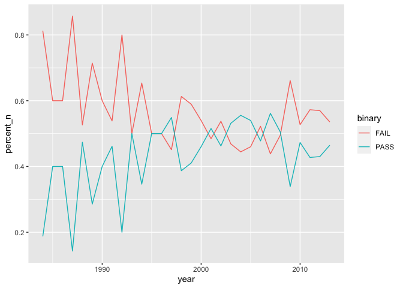
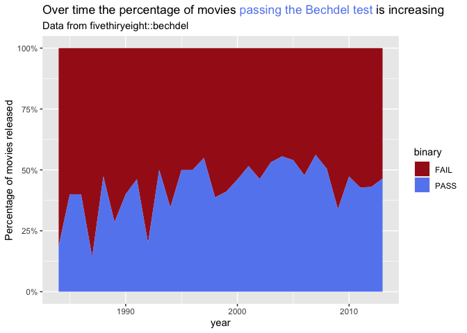
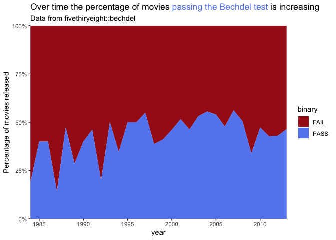
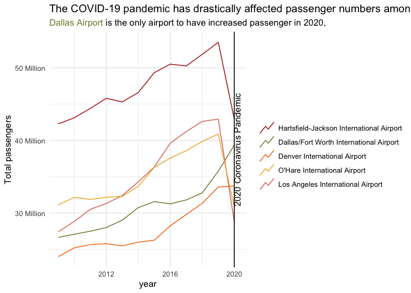
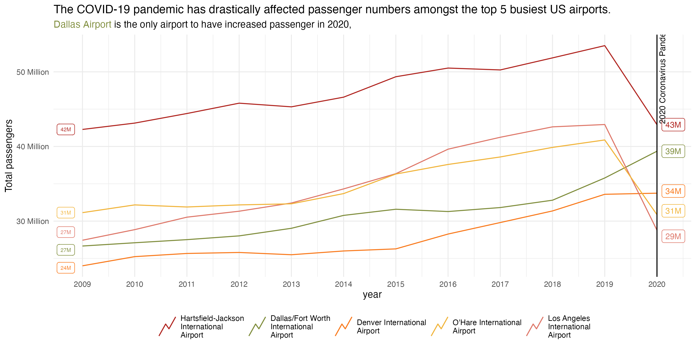

<!-- README.md is generated from README.Rmd. Please edit that file -->

# rin3-2020-fall\_week-11-dataviz

<!-- badges: start -->
<!-- badges: end -->

This repository contains example data visualisations for Week 11’s
assignment in R in 3 Months.

## Different types of chart

In Week 11 David shows several different types of chart and how it’s a
good idea to experiment with alternative geoms.

We’ve used geom\_line() a few times to visualise time series:

``` r
bechdel_pass_rate_over_time <- bechdel %>%
  filter(year >= 1984) %>% 
  select(year, binary) %>% 
  count(year, binary) %>% 
  group_by(year) %>% 
  mutate(percent_n = n / sum(n))


bechdel_pass_rate_over_time %>% 
  ggplot(aes(x = year,
             y = percent_n,
             color = binary)) +
  geom_line()
```

<!-- -->

Alternatively, we could create a filled area chart with scale\_area().
I’ve also used the {ggtext} package to give a more meaningful title to
the chart:

``` r
bechdel_pass_rate_over_time %>% 
  ggplot(aes(x = year,
             y = percent_n,
             fill = binary)) +
  geom_area(position = "stack") +
  scale_fill_manual(values = c("FAIL" = "#A61C1B", "PASS" = "#6689F0")) +
  scale_y_continuous(labels = scales::percent_format()) +
  labs(title = "Over time the percentage of movies <span style='color:#6689F0'>passing the Bechdel test</span> is increasing",
       y = "Percentage of movies released",
       subtitle = "Data from fivethiryeight::bechdel") +
  theme(plot.title = element_markdown())
```

<!-- -->

With a little bit of fine tuning we can tidy up this chart even further:

``` r
bechdel_pass_rate_over_time %>% 
  ggplot(aes(x = year,
             # ymax = percent_n,
             # ymin = 0,
             y = percent_n,
             fill = binary)) +
  geom_area(position = "stack") +
  scale_fill_manual(values = c("FAIL" = "#A61C1B", "PASS" = "#6689F0")) +
  scale_y_continuous(labels = scales::percent_format(),
                     expand = c(0, 0)) +
  scale_x_continuous(expand = c(0, 0)) +
  labs(title = "Over time the percentage of movies <span style='color:#6689F0'>passing the Bechdel test</span> is increasing",
       y = "Percentage of movies released",
       subtitle = "Data from fivethiryeight::bechdel") +
  theme(plot.title = element_markdown())
```

<!-- -->

## Tables

David introduced the {gt} packages for creating good looking tables.
Here’s an example visualising the most popular episodes from the reboot
of Dr. Who:

``` r
dr_who_episodes <- readr::read_csv('https://raw.githubusercontent.com/rfordatascience/tidytuesday/master/data/2021/2021-11-23/episodes.csv')
#> Rows: 172 Columns: 12
#> ── Column specification ────────────────────────────────────────────────────────
#> Delimiter: ","
#> chr  (6): era, serial_title, story_number, episode_title, type, production_code
#> dbl  (5): season_number, episode_number, uk_viewers, rating, duration
#> date (1): first_aired
#> 
#> ℹ Use `spec()` to retrieve the full column specification for this data.
#> ℹ Specify the column types or set `show_col_types = FALSE` to quiet this message.

most_popular_by_season <- dr_who_episodes %>% 
  select(season_number, episode_title, uk_viewers) %>% 
  mutate(uk_viewers = 1E6 * uk_viewers) %>% 
  arrange(season_number) %>% 
  drop_na() %>% 
  group_by(season_number) %>% 
  filter(uk_viewers == max(uk_viewers)) %>% 
  ungroup() %>% 
  mutate(growth = (uk_viewers - lag(uk_viewers)) / uk_viewers)

most_popular_by_season %>% 
  gt() %>% 
  cols_label(season_number = "Season",
             episode_title = "Episode Title",
             uk_viewers = "UK Viewers (Millions)",
             growth = "Growth (compared to previous season)") %>% 
  fmt_number(columns = uk_viewers,
             suffixing = TRUE) %>% 
  fmt_percent(growth) %>% 
  fmt_missing(columns = growth,
              missing_text = "") %>% 
  tab_style(
    style = cell_text(color = "red"),
    locations = cells_body(
    columns = growth,
    rows = growth < 0
  ))
```

<div id="bawfnlnhjp" style="overflow-x:auto;overflow-y:auto;width:auto;height:auto;">
<style>html {
  font-family: -apple-system, BlinkMacSystemFont, 'Segoe UI', Roboto, Oxygen, Ubuntu, Cantarell, 'Helvetica Neue', 'Fira Sans', 'Droid Sans', Arial, sans-serif;
}

#bawfnlnhjp .gt_table {
  display: table;
  border-collapse: collapse;
  margin-left: auto;
  margin-right: auto;
  color: #333333;
  font-size: 16px;
  font-weight: normal;
  font-style: normal;
  background-color: #FFFFFF;
  width: auto;
  border-top-style: solid;
  border-top-width: 2px;
  border-top-color: #A8A8A8;
  border-right-style: none;
  border-right-width: 2px;
  border-right-color: #D3D3D3;
  border-bottom-style: solid;
  border-bottom-width: 2px;
  border-bottom-color: #A8A8A8;
  border-left-style: none;
  border-left-width: 2px;
  border-left-color: #D3D3D3;
}

#bawfnlnhjp .gt_heading {
  background-color: #FFFFFF;
  text-align: center;
  border-bottom-color: #FFFFFF;
  border-left-style: none;
  border-left-width: 1px;
  border-left-color: #D3D3D3;
  border-right-style: none;
  border-right-width: 1px;
  border-right-color: #D3D3D3;
}

#bawfnlnhjp .gt_title {
  color: #333333;
  font-size: 125%;
  font-weight: initial;
  padding-top: 4px;
  padding-bottom: 4px;
  border-bottom-color: #FFFFFF;
  border-bottom-width: 0;
}

#bawfnlnhjp .gt_subtitle {
  color: #333333;
  font-size: 85%;
  font-weight: initial;
  padding-top: 0;
  padding-bottom: 6px;
  border-top-color: #FFFFFF;
  border-top-width: 0;
}

#bawfnlnhjp .gt_bottom_border {
  border-bottom-style: solid;
  border-bottom-width: 2px;
  border-bottom-color: #D3D3D3;
}

#bawfnlnhjp .gt_col_headings {
  border-top-style: solid;
  border-top-width: 2px;
  border-top-color: #D3D3D3;
  border-bottom-style: solid;
  border-bottom-width: 2px;
  border-bottom-color: #D3D3D3;
  border-left-style: none;
  border-left-width: 1px;
  border-left-color: #D3D3D3;
  border-right-style: none;
  border-right-width: 1px;
  border-right-color: #D3D3D3;
}

#bawfnlnhjp .gt_col_heading {
  color: #333333;
  background-color: #FFFFFF;
  font-size: 100%;
  font-weight: normal;
  text-transform: inherit;
  border-left-style: none;
  border-left-width: 1px;
  border-left-color: #D3D3D3;
  border-right-style: none;
  border-right-width: 1px;
  border-right-color: #D3D3D3;
  vertical-align: bottom;
  padding-top: 5px;
  padding-bottom: 6px;
  padding-left: 5px;
  padding-right: 5px;
  overflow-x: hidden;
}

#bawfnlnhjp .gt_column_spanner_outer {
  color: #333333;
  background-color: #FFFFFF;
  font-size: 100%;
  font-weight: normal;
  text-transform: inherit;
  padding-top: 0;
  padding-bottom: 0;
  padding-left: 4px;
  padding-right: 4px;
}

#bawfnlnhjp .gt_column_spanner_outer:first-child {
  padding-left: 0;
}

#bawfnlnhjp .gt_column_spanner_outer:last-child {
  padding-right: 0;
}

#bawfnlnhjp .gt_column_spanner {
  border-bottom-style: solid;
  border-bottom-width: 2px;
  border-bottom-color: #D3D3D3;
  vertical-align: bottom;
  padding-top: 5px;
  padding-bottom: 5px;
  overflow-x: hidden;
  display: inline-block;
  width: 100%;
}

#bawfnlnhjp .gt_group_heading {
  padding: 8px;
  color: #333333;
  background-color: #FFFFFF;
  font-size: 100%;
  font-weight: initial;
  text-transform: inherit;
  border-top-style: solid;
  border-top-width: 2px;
  border-top-color: #D3D3D3;
  border-bottom-style: solid;
  border-bottom-width: 2px;
  border-bottom-color: #D3D3D3;
  border-left-style: none;
  border-left-width: 1px;
  border-left-color: #D3D3D3;
  border-right-style: none;
  border-right-width: 1px;
  border-right-color: #D3D3D3;
  vertical-align: middle;
}

#bawfnlnhjp .gt_empty_group_heading {
  padding: 0.5px;
  color: #333333;
  background-color: #FFFFFF;
  font-size: 100%;
  font-weight: initial;
  border-top-style: solid;
  border-top-width: 2px;
  border-top-color: #D3D3D3;
  border-bottom-style: solid;
  border-bottom-width: 2px;
  border-bottom-color: #D3D3D3;
  vertical-align: middle;
}

#bawfnlnhjp .gt_from_md > :first-child {
  margin-top: 0;
}

#bawfnlnhjp .gt_from_md > :last-child {
  margin-bottom: 0;
}

#bawfnlnhjp .gt_row {
  padding-top: 8px;
  padding-bottom: 8px;
  padding-left: 5px;
  padding-right: 5px;
  margin: 10px;
  border-top-style: solid;
  border-top-width: 1px;
  border-top-color: #D3D3D3;
  border-left-style: none;
  border-left-width: 1px;
  border-left-color: #D3D3D3;
  border-right-style: none;
  border-right-width: 1px;
  border-right-color: #D3D3D3;
  vertical-align: middle;
  overflow-x: hidden;
}

#bawfnlnhjp .gt_stub {
  color: #333333;
  background-color: #FFFFFF;
  font-size: 100%;
  font-weight: initial;
  text-transform: inherit;
  border-right-style: solid;
  border-right-width: 2px;
  border-right-color: #D3D3D3;
  padding-left: 12px;
}

#bawfnlnhjp .gt_summary_row {
  color: #333333;
  background-color: #FFFFFF;
  text-transform: inherit;
  padding-top: 8px;
  padding-bottom: 8px;
  padding-left: 5px;
  padding-right: 5px;
}

#bawfnlnhjp .gt_first_summary_row {
  padding-top: 8px;
  padding-bottom: 8px;
  padding-left: 5px;
  padding-right: 5px;
  border-top-style: solid;
  border-top-width: 2px;
  border-top-color: #D3D3D3;
}

#bawfnlnhjp .gt_grand_summary_row {
  color: #333333;
  background-color: #FFFFFF;
  text-transform: inherit;
  padding-top: 8px;
  padding-bottom: 8px;
  padding-left: 5px;
  padding-right: 5px;
}

#bawfnlnhjp .gt_first_grand_summary_row {
  padding-top: 8px;
  padding-bottom: 8px;
  padding-left: 5px;
  padding-right: 5px;
  border-top-style: double;
  border-top-width: 6px;
  border-top-color: #D3D3D3;
}

#bawfnlnhjp .gt_striped {
  background-color: rgba(128, 128, 128, 0.05);
}

#bawfnlnhjp .gt_table_body {
  border-top-style: solid;
  border-top-width: 2px;
  border-top-color: #D3D3D3;
  border-bottom-style: solid;
  border-bottom-width: 2px;
  border-bottom-color: #D3D3D3;
}

#bawfnlnhjp .gt_footnotes {
  color: #333333;
  background-color: #FFFFFF;
  border-bottom-style: none;
  border-bottom-width: 2px;
  border-bottom-color: #D3D3D3;
  border-left-style: none;
  border-left-width: 2px;
  border-left-color: #D3D3D3;
  border-right-style: none;
  border-right-width: 2px;
  border-right-color: #D3D3D3;
}

#bawfnlnhjp .gt_footnote {
  margin: 0px;
  font-size: 90%;
  padding: 4px;
}

#bawfnlnhjp .gt_sourcenotes {
  color: #333333;
  background-color: #FFFFFF;
  border-bottom-style: none;
  border-bottom-width: 2px;
  border-bottom-color: #D3D3D3;
  border-left-style: none;
  border-left-width: 2px;
  border-left-color: #D3D3D3;
  border-right-style: none;
  border-right-width: 2px;
  border-right-color: #D3D3D3;
}

#bawfnlnhjp .gt_sourcenote {
  font-size: 90%;
  padding: 4px;
}

#bawfnlnhjp .gt_left {
  text-align: left;
}

#bawfnlnhjp .gt_center {
  text-align: center;
}

#bawfnlnhjp .gt_right {
  text-align: right;
  font-variant-numeric: tabular-nums;
}

#bawfnlnhjp .gt_font_normal {
  font-weight: normal;
}

#bawfnlnhjp .gt_font_bold {
  font-weight: bold;
}

#bawfnlnhjp .gt_font_italic {
  font-style: italic;
}

#bawfnlnhjp .gt_super {
  font-size: 65%;
}

#bawfnlnhjp .gt_footnote_marks {
  font-style: italic;
  font-weight: normal;
  font-size: 65%;
}
</style>
<table class="gt_table">
  
  <thead class="gt_col_headings">
    <tr>
      <th class="gt_col_heading gt_columns_bottom_border gt_right" rowspan="1" colspan="1">Season</th>
      <th class="gt_col_heading gt_columns_bottom_border gt_left" rowspan="1" colspan="1">Episode Title</th>
      <th class="gt_col_heading gt_columns_bottom_border gt_right" rowspan="1" colspan="1">UK Viewers (Millions)</th>
      <th class="gt_col_heading gt_columns_bottom_border gt_right" rowspan="1" colspan="1">Growth (compared to previous season)</th>
    </tr>
  </thead>
  <tbody class="gt_table_body">
    <tr><td class="gt_row gt_right">1</td>
<td class="gt_row gt_left">Rose</td>
<td class="gt_row gt_right">10.81M</td>
<td class="gt_row gt_right"></td></tr>
    <tr><td class="gt_row gt_right">2</td>
<td class="gt_row gt_left">The Christmas Invasion</td>
<td class="gt_row gt_right">9.84M</td>
<td class="gt_row gt_right" style="color: #FF0000;">&minus;9.86&percnt;</td></tr>
    <tr><td class="gt_row gt_right">3</td>
<td class="gt_row gt_left">The Runaway Bride</td>
<td class="gt_row gt_right">9.35M</td>
<td class="gt_row gt_right" style="color: #FF0000;">&minus;5.24&percnt;</td></tr>
    <tr><td class="gt_row gt_right">4</td>
<td class="gt_row gt_left">Voyage of the Damned</td>
<td class="gt_row gt_right">13.31M</td>
<td class="gt_row gt_right">29.75&percnt;</td></tr>
    <tr><td class="gt_row gt_right">5</td>
<td class="gt_row gt_left">The Eleventh Hour</td>
<td class="gt_row gt_right">10.09M</td>
<td class="gt_row gt_right" style="color: #FF0000;">&minus;31.91&percnt;</td></tr>
    <tr><td class="gt_row gt_right">6</td>
<td class="gt_row gt_left">A Christmas Carol</td>
<td class="gt_row gt_right">12.11M</td>
<td class="gt_row gt_right">16.68&percnt;</td></tr>
    <tr><td class="gt_row gt_right">7</td>
<td class="gt_row gt_left">The Doctor, the Widow and the Wardrobe</td>
<td class="gt_row gt_right">10.77M</td>
<td class="gt_row gt_right" style="color: #FF0000;">&minus;12.44&percnt;</td></tr>
    <tr><td class="gt_row gt_right">8</td>
<td class="gt_row gt_left">Deep Breath</td>
<td class="gt_row gt_right">9.17M</td>
<td class="gt_row gt_right" style="color: #FF0000;">&minus;17.45&percnt;</td></tr>
    <tr><td class="gt_row gt_right">9</td>
<td class="gt_row gt_left">Last Christmas</td>
<td class="gt_row gt_right">8.28M</td>
<td class="gt_row gt_right" style="color: #FF0000;">&minus;10.75&percnt;</td></tr>
    <tr><td class="gt_row gt_right">10</td>
<td class="gt_row gt_left">Twice Upon a Time</td>
<td class="gt_row gt_right">7.92M</td>
<td class="gt_row gt_right" style="color: #FF0000;">&minus;4.55&percnt;</td></tr>
    <tr><td class="gt_row gt_right">11</td>
<td class="gt_row gt_left">The Woman Who Fell to Earth</td>
<td class="gt_row gt_right">10.96M</td>
<td class="gt_row gt_right">27.74&percnt;</td></tr>
    <tr><td class="gt_row gt_right">12</td>
<td class="gt_row gt_left">Spyfall, Part 1</td>
<td class="gt_row gt_right">6.89M</td>
<td class="gt_row gt_right" style="color: #FF0000;">&minus;59.07&percnt;</td></tr>
    <tr><td class="gt_row gt_right">13</td>
<td class="gt_row gt_left">The Halloween Apocalypse</td>
<td class="gt_row gt_right">5.79M</td>
<td class="gt_row gt_right" style="color: #FF0000;">&minus;19.00&percnt;</td></tr>
  </tbody>
  
  
</table>
</div>

## Annotation

Annotations can really help add story/explanations to your charts. In
the line chart below I’ve used geom\_vline() and annotate() to clearly
identify the COVID-19 pandemic. I’ve also used {ggtext} to highlight an
interesting feature of the data:

``` r
busiest_us_airports <- read_csv("data/busiest-us-airports.csv")
#> Rows: 60 Columns: 3
#> ── Column specification ────────────────────────────────────────────────────────
#> Delimiter: ","
#> chr (1): airport
#> dbl (2): year, passengers
#> 
#> ℹ Use `spec()` to retrieve the full column specification for this data.
#> ℹ Specify the column types or set `show_col_types = FALSE` to quiet this message.


min_passengers <- min(busiest_us_airports$passengers)
max_passengers <- max(busiest_us_airports$passengers)
annotation_y_center <- min_passengers + (max_passengers - min_passengers) / 2         

colors_airports <- c("Hartsfield-Jackson International Airport" = "#B0241F",
                     "Dallas/Fort Worth International Airport" = "#7F8D3C",
                     "Denver International Airport" = "#F97A1D",
                     "O'Hare International Airport" = "#F1B43A",
                     "Los Angeles International Airport" = "#DE7769")

busiest_us_airports %>% 
  ggplot(aes(x = year,
             y = passengers,
             color = airport)) +
  geom_line(key_glyph = "timeseries") +
  geom_vline(xintercept = 2020) +
  annotate("text",
           x = 2020 + 0.2,
           y = annotation_y_center,
           label = "2020 Coronavirus Pandemic",
           angle = 90
  ) +
  scale_y_continuous(labels = scales::number_format(scale = 1E-6,
                                                    suffix = " Million")) +
  scale_color_manual(values = colors_airports,
                     name = "") +
  labs(y = "Total passengers",
       title = "The COVID-19 pandemic has drastically affected passenger numbers amongst the top 5 busiest US airports.",
       subtitle = "<span style='color:#7F8D3C'>Dallas Airport</span> is the only airport to have increased passenger in 2020,") +
  theme_minimal() +
  theme(plot.subtitle = element_markdown())
```



With a little bit more effort and the {ggrepel} package we can add
labels to either end of the lines. Please note that I used ggsave() to
fully control the dimensions of the chart and then it’s been inserted
into the RMarkdown output with knitr::include\_graphics()

``` r
gg_busiest_airport <- busiest_us_airports %>% 
  ggplot(aes(x = year,
             y = passengers,
             color = airport)) +
  geom_line(key_glyph = "timeseries") +
  geom_vline(xintercept = 2020) +
  geom_label_repel(aes(label = ifelse(year == 2009, scales::number(passengers, 
                                                                   scale = 1E-6, 
                                                                   suffix = "M",
                                                                   accuracy = 1), "")),
                   nudge_x = -0.5,
                   segment.color = 'transparent',
                   size = 2,
                   show.legend = FALSE) +
  geom_label_repel(aes(label = ifelse(year == 2020, scales::number(passengers, 
                                                                   scale = 1E-6, 
                                                                   suffix = "M",
                                                                   accuracy = 1), "")),
                   nudge_x = 0.1,
                   segment.color = 'transparent',
                   size = 3,
                   show.legend = FALSE) +
  annotate("text",
           x = 2020 + 0.1,
           y = 50E6,
           label = "2020 Coronavirus Pandemic",
           angle = 90,
           size = 3
           ) +
  scale_y_continuous(labels = scales::number_format(scale = 1E-6,
                                                    suffix = " Million")) +
  scale_x_continuous(breaks = unique(busiest_us_airports$year)) +
  scale_color_manual(values = colors_airports,
                     labels = function(x) str_wrap(x, width = 20),
                     name = "") +
  labs(y = "Total passengers",
       title = "The COVID-19 pandemic has drastically affected passenger numbers amongst the top 5 busiest US airports.",
       subtitle = "<span style='color:#7F8D3C'>Dallas Airport</span> is the only airport to have increased passenger in 2020,") +
  theme_minimal(base_size = 10) +
  theme(plot.subtitle = element_markdown(),
        legend.position = "bottom")

ggsave("README_files/images/gg_busiest_airport.png",
       gg_busiest_airport,
       width = 10,
       height = 5)


```


